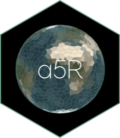

<!-- README.md is generated from README.Rmd. Please edit that file -->

```{r, include = FALSE}
knitr::opts_chunk$set(
  collapse = TRUE,
  comment = "#>",
  fig.path = "man/figures/README-",
  out.width = "100%"
)
```

# a5R <a href="https://belian-earth.github.io/a5R/"></a>

<!-- badges: start -->
[](https://github.com/belian-earth/a5R/actions/workflows/R-CMD-check.yaml)
[](https://app.codecov.io/gh/belian-earth/a5R)
[](https://extendr.rs/extendr/extendr_api/)
[](https://lifecycle.r-lib.org/articles/stages.html#stable)
[](https://www.apache.org/licenses/LICENSE-2.0)
[](https://github.com/belian-earth/a5R/stargazers)
[](https://github.com/belian-earth/a5R/issues)
<!-- badges: end -->

a5R provides R bindings for the [A5](https://a5geo.org/) pentagonal geospatial index, powered by the
[a5 Rust crate](https://github.com/felixpalmer/a5-rs) via
[extendr](https://extendr.rs/extendr/extendr_api/).

A5 partitions the Earth's surface into pentagonal cells across 31 resolution
levels. Cells are equal-area, encoded as 64-bit integers, and achieve
millimetre-level precision at the finest resolution.

## Installation

``` r
install.packages("a5R")
```

Or install the development version from GitHub:

``` r
# install.packages("pak")
pak::pak("belian-earth/a5R")
```

You will need a working [Rust toolchain](https://rustup.rs/) (`cargo` and
`rustc`).

## Quick example

```{r example}
library(a5R)

# Index a point to a cell
cell <- a5_lonlat_to_cell(-3.19, 55.95, resolution = 10)
cell

# Get the boundary polygon
a5_cell_to_boundary(cell)

# Navigate the hierarchy
a5_cell_to_parent(cell)
a5_cell_to_children(cell)
```

```{r grid-plot, fig.alt = "A5 grid plot showing a collection of cells around a point"}
# Create a collection of cells whose centres fall within a great-circle distance of 100km from the origin cell
cells <- a5_spherical_cap(cell, radius = 100000) |> 
  a5_uncompact(resolution = 10)
plot(a5_cell_to_boundary(cells), col = "#206ead20", border = "#206ead", asp = 1)
```

See `vignette("a5R")` for a full walkthrough of indexing, boundaries,
hierarchy, traversal, and grid generation.

## Features

- **Vectorised Rust core** --- all operations implemented in Rust and called
  from R via extendr. [Benchmarks](https://github.com/belian-earth/a5R/blob/main/benchmarks/RESULTS.md)
  confirm identical results to the Python, JavaScript, and DuckDB A5
  implementations.
- **vctrs + wk integration** --- cell indices use an `a5_cell` type with
  tibble support; geometries return as `wk_wkb`/`wk_wkt` vectors compatible
  with sf and terra.
- **Grid generation** --- `a5_grid()` fills any bounding box or geometry with
  cells at a target resolution using hierarchical flood-fill.
- **Traversal** --- `a5_grid_disk()` and `a5_spherical_cap()` select
  neighbours by hop count or great-circle distance.
- **Multi-threading** --- opt-in parallel processing via rayon for vectorised
  operations. See `vignette("multithreading")`.

## Acknowledgements

A5 was created by [Felix Palmer](https://github.com/felixpalmer). This package
is a thin R wrapper around his work and would not exist without it. The
[Query-farm](https://github.com/Query-farm/a5) team maintain the DuckDB A5
extension, which wraps the same Rust crate and provided a valuable reference
for this project.
