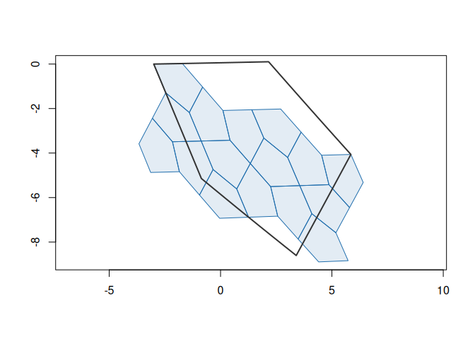
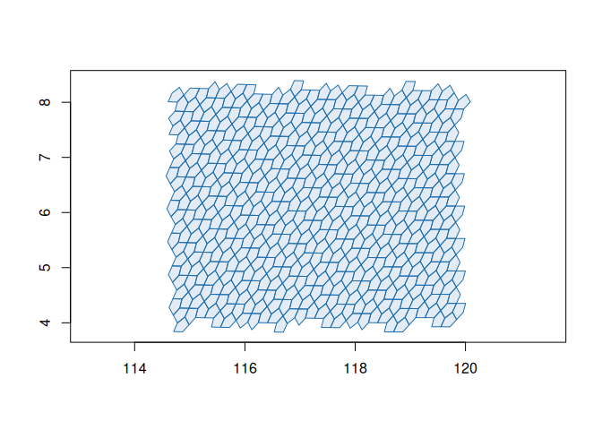

<!-- README.md is generated from README.Rmd. Please edit that file -->

# a5R

<!-- badges: start -->

[](https://github.com/belian-earth/a5R/actions/workflows/R-CMD-check.yaml)
[](https://app.codecov.io/gh/belian-earth/a5R)
[](https://lifecycle.r-lib.org/articles/stages.html#experimental)
[](https://extendr.github.io/extendr/extendr_api/)
<!-- badges: end -->

a5R provides R bindings for the [A5](https://a5geo.org/) pentagonal
discrete global grid system (DGGS), powered by the [a5 Rust
crate](https://crates.io/crates/A5) via
[extendr](https://extendr.github.io/extendr/extendr_api/).

a5 partitions the Earth’s surface into pentagonal cells across 31
resolution levels. Cells are equal-area, encoded as 64-bit integers, and
achieve millimetre-level precision at the finest resolution. For a full
description of the system, see the [A5 project page](https://a5geo.org/)
and the [reference implementation](https://github.com/felixpalmer/a5) by
Felix Palmer.

## R-specific design

- **vctrs**: Cell indices are represented as an `a5_cell` vector type
  built on [vctrs](https://vctrs.r-lib.org/), giving you type safety,
  column support in tibbles, and natural coercion to/from character.
- **wk**: Boundary geometries and cell centroids are returned as
  [wk](https://paleolimbot.github.io/wk/) geometry vectors (`wk_wkt` and
  `xy`), so they integrate directly with sf, terra, and other spatial
  tooling.

## Installation

You can install the development version of a5R from
[GitHub](https://github.com/belian-earth/a5R) with:

``` r
# install.packages("pak")
pak::pak("belian-earth/a5R")
```

You will need a working [Rust toolchain](https://rustup.rs/) (`cargo`
and `rustc`).

## Examples

``` r
library(a5R)
```

Index a point to a cell at resolution 5:

``` r
cell <- a5_lonlat_to_cell(-3.19, 55.95, resolution = 5)
cell
#> <a5_cell[1]>
#> [1] 633e000000000000
```

Convert back to coordinates:

``` r
a5_cell_to_lonlat(cell)
#> <wk_xy[1] with CRS=OGC:CRS84>
#> [1] (-3.280745 56.43135)
```

Get the cell boundary polygon:

``` r
a5_cell_to_boundary(cell)
#> <wk_wkb[1] with CRS=OGC:CRS84>
#> [1] <POLYGON ((-4.490769 56.63193, -4.575103 55.93184, -4.654266 55.23196, -3.592316 55.41531, -2.521971 55.5901, -2.031558 56.23106...>
```

Navigate the hierarchy:

``` r
a5_cell_to_parent(cell)
#> <a5_cell[1]>
#> [1] 6338000000000000
a5_cell_to_children(cell)
#> <a5_cell[4]>
#> [1] 633c800000000000 633d800000000000 633e800000000000 633f800000000000
```

Cell info:

``` r
a5_get_resolution(cell)
#> [1] 5
a5_cell_area(0:5)
#> Units: [m^2]
#> [1] 4.250547e+13 8.501094e+12 2.125273e+12 5.313184e+11 1.328296e+11
#> [6] 3.320740e+10
```

### Visualising the grid hierarchy

``` r
# A cell and its children two levels down
parent <- a5_lonlat_to_cell(0, 0, resolution = 3)
children <- a5_cell_to_children(parent, resolution = 5)

# wk geometries plot directly with base graphics
plot(a5_cell_to_boundary(children), col = "#206ead20", border = "#206ead", asp = 1)
plot(a5_cell_to_boundary(parent), border = "#333333", lwd = 2, add = TRUE)
```



### Grid generation

Generate all cells covering an area with `a5_grid()`:

``` r
cells <- a5_grid(c(114.8, 4.1, 119.8, 8.1), resolution = 8)
plot(a5_cell_to_boundary(cells), col = "#206ead20", border = "#206ead", asp = 1)
```



Any geometry that [wk](https://paleolimbot.github.io/wk/) can handle
works as input, including sf objects and WKT strings. Bounding boxes
that cross the antimeridian are supported too:

``` r
# Fiji — bbox crosses the antimeridian
a5_grid(c(177, -19, -178, -17), resolution = 5)
#> <a5_cell[9]>
#> [1] 963e000000000000 9642000000000000 964e000000000000 9766000000000000
#> [5] 976a000000000000 976e000000000000 9862000000000000 9866000000000000
#> [9] 9786000000000000
```

## Performance

a5R provides a performant interface to the A5 indexing system, with all
core operations implemented in Rust and called directly from R via
[extendr](https://extendr.github.io/). Cross-language
[benchmarks](https://github.com/belian-earth/a5R/blob/main/benchmarks/RESULTS.md)
and consistency checks against the Python, JavaScript, and DuckDB A5
implementations confirm that results are identical across all APIs.

## Acknowledgements

A5 was created by [Felix Palmer](https://github.com/felixpalmer). This
package is a thin R wrapper around his work and would not exist without
it. The [Query-farm](https://github.com/Query-farm/a5) team maintain the
DuckDB A5 extension, which wraps the same Rust crate and provided a
valuable reference for this project.
