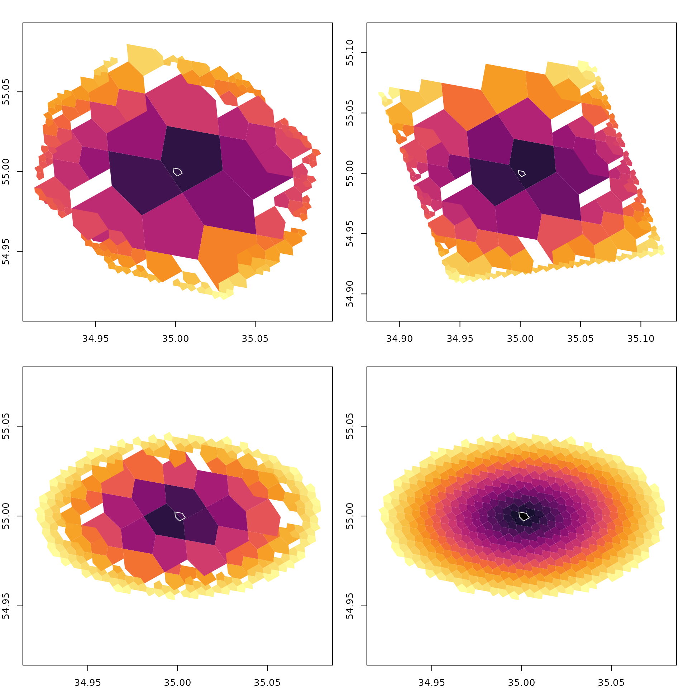
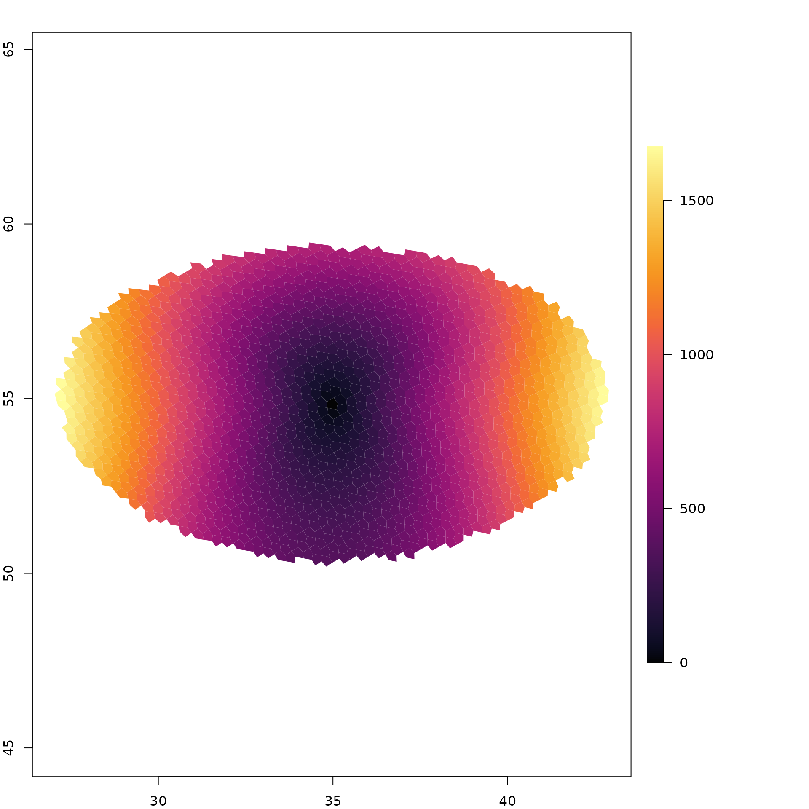

# Traversal and distance

``` r
library(a5R)
```

## Selecting cells around a point

Pick an origin cell and use
[`a5_spherical_cap()`](https://belian-earth.github.io/a5R/reference/a5_spherical_cap.md)
to grab every cell whose centre falls within a given great-circle
radius. The result is compacted, so pass it through
[`a5_uncompact()`](https://belian-earth.github.io/a5R/reference/a5_uncompact.md)
for a uniform-resolution grid.

``` r
origin <- a5_lonlat_to_cell(35, 55, resolution = 14)

disk <- a5_grid_disk(origin, k = 20, vertex = FALSE)
disk_vertex <- a5_grid_disk(origin, k = 20, vertex = TRUE)
cap_compact <- a5_spherical_cap(origin, radius = 5000)
cap <- a5_uncompact(cap_compact, resolution = 14)
```

[`a5_grid_disk()`](https://belian-earth.github.io/a5R/reference/a5_grid_disk.md)
selects cells by hop count rather than metric distance. With
`vertex = FALSE` (default) only edge-sharing neighbours are traversed
(4-connected), producing a diamond shape. Setting `vertex = TRUE`
includes corner-sharing neighbours too (8-connected), giving a squarer
footprint.

## Distance heatmap

Compute the distance from the origin to every cell in the cap (or disk)
and visualise it as a colour gradient.

``` r
dcap <- a5_cell_distance(origin, cap, units = "km")
dcap_compact <- a5_cell_distance(origin, cap_compact, units = "km")
ddisk <- a5_cell_distance(origin, disk, units = "km")
ddisk_vertex <- a5_cell_distance(origin, disk_vertex, units = "km")

pal <- hcl.colors(256, "Inferno")

oldpar <- par(mfrow = c(2, 2), mar = c(2, 2, 2, 1))
for (info in list(
  list(s = disk, d = ddisk, lab = "Grid disk (edges)"),
  list(s = disk_vertex, d = ddisk_vertex, lab = "Grid disk (vertices)"),
  list(s = cap_compact, d = dcap_compact, lab = "Spherical cap (compact)"),
  list(s = cap, d = dcap, lab = "Spherical cap")
)) {
  brk <- seq(0, max(as.numeric(info$d)), length.out = 257)
  cols <- pal[findInterval(as.numeric(info$d), brk, all.inside = TRUE)]

  plot(a5_cell_to_boundary(info$s), col = cols, border = NA, asp = 1,
       main = info$lab)
  plot(a5_cell_to_boundary(origin), border = "#ffffffff", add = TRUE)
}
```



Distance radiates smoothly from the centre — cells near the origin are
dark, cells at the rim are bright. The origin cell is shown with a white
border for reference.

## Distance methods

a5R supports three distance methods: **haversine** (great-circle),
**geodesic** (WGS84 ellipsoid via Karney 2013), and **rhumb** (loxodrome
/ constant-bearing). For short distances they are nearly identical;
differences grow with distance.

``` r
wide_origin <- a5_lonlat_to_cell(35, 55, resolution = 8)
wide_cap <- a5_uncompact(
  a5_spherical_cap(wide_origin, radius = 500000),
  resolution = 8
)

hav <- a5_cell_distance(wide_origin, wide_cap, units = "m", method = "haversine")
geo <- a5_cell_distance(wide_origin, wide_cap, units = "m", method = "geodesic")

diff_m <- as.numeric(geo - hav)
brk <- seq(min(diff_m), max(diff_m), length.out = 257)
cols <- pal[findInterval(diff_m, brk, all.inside = TRUE)]

oldpar <- par(no.readonly = TRUE)
layout(matrix(c(1, 2), nrow = 1), widths = c(4, 1))
par(mar = c(2, 2, 2, 1))
plot(a5_cell_to_boundary(wide_cap), col = cols, border = NA, asp = 1,
     main = "Geodesic \u2212 Haversine (m)")

par(mar = c(9, 0, 9, 9))
image(1, seq(min(diff_m), max(diff_m), length.out = 256),
      t(seq_along(pal)), col = pal, axes = FALSE, xlab = "", ylab = "")
axis(4, las = 1)
```



The difference is near zero at the centre and grows to ~1675 m at the
rim (~500 km away).
