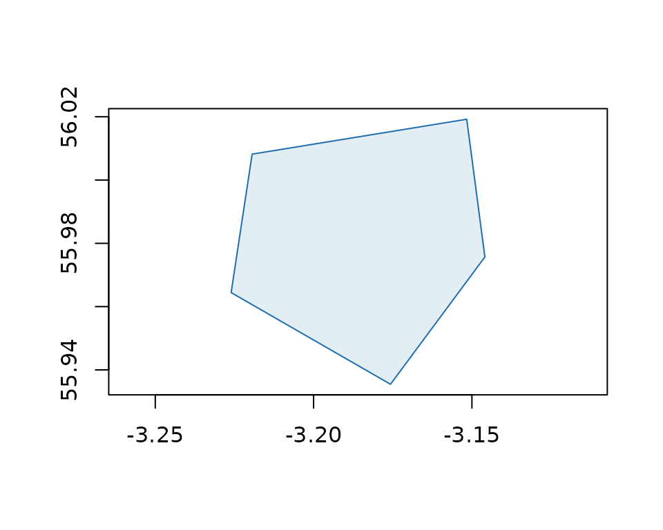
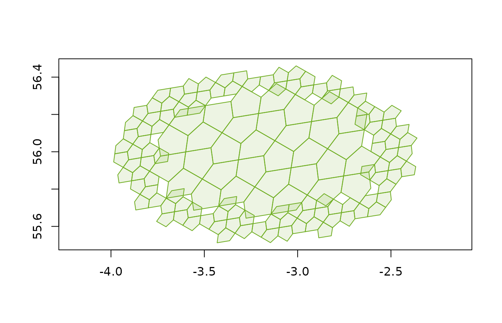

# Getting started with a5R

``` r
library(a5R)
```

## Index a point

Map a longitude/latitude coordinate to a cell at a given resolution
(0–30). Higher resolutions produce smaller cells.

``` r
cell <- a5_lonlat_to_cell(-3.19, 55.95, resolution = 10)
cell
#> <a5_cell[1]>
#> [1] 6344be8000000000
```

Convert back to the cell centre point:

``` r
a5_cell_to_lonlat(cell)
#> <wk_xy[1] with CRS=OGC:CRS84>
#> [1] (-3.183746 55.9806)
```

## Cell boundaries

Get the boundary polygon for one or more cells:

``` r
boundary <- a5_cell_to_boundary(cell)
boundary
#> <wk_wkb[1] with CRS=OGC:CRS84>
#> [1] <POLYGON ((-3.175718 55.93546, -3.145905 55.97569, -3.151641 56.01921, -3.219413 56.00818, -3.226037 55.96443, -3.175718 55.93546...>

plot(boundary, col = "#206ead20", border = "#206ead", asp = 1)
```



Boundaries are returned as `wk_wkb` vectors by default (set
`format = "wkt"` for WKT). Both integrate directly with sf, terra, and
other spatial tooling via the wk package.

## Hierarchy and compaction

A5 is a hierarchical grid: every cell has a **parent** at a coarser
resolution and 4 **children** at the next finer resolution.

``` r
parent <- a5_cell_to_parent(cell)
parent
#> <a5_cell[1]>
#> [1] 6344be0000000000

children <- a5_cell_to_children(cell)
children
#> <a5_cell[4]>
#> [1] 6344be2000000000 6344be6000000000 6344bea000000000 6344bee000000000
```

We can visualise the relationship - the parent (dark outline) contains
our cell (blue fill), which in turn contains its 4 children (orange):

``` r
plot(NULL, xlim = c(-3.23, -3),  ylim = c(55.98, 55.99),               
       xlab = "", ylab = "", asp = 1
       )
plot(a5_cell_to_boundary(a5_cell_to_children(cell)),
     col = "#ad6e2020", border = "#ad6e20", add = TRUE)
plot(a5_cell_to_boundary(cell), col = "#206ead40", border = "#206ead",
     lwd = 2, add = TRUE)
plot(a5_cell_to_boundary(parent), border = "#333333", lwd = 2, add = TRUE)
```


Cell area decreases geometrically — each level is roughly 4x smaller:

``` r
a5_cell_area(0:5)
#> Units: [m^2]
#> [1] 4.250547e+13 8.501094e+12 2.125273e+12 5.313184e+11 1.328296e+11
#> [6] 3.320740e+10
```

### Compact and uncompact

When a complete set of siblings is present,
[`a5_compact()`](https://belian-earth.github.io/a5R/dev/reference/a5_compact.md)
merges them back into their shared parent. This is the inverse of
[`a5_cell_to_children()`](https://belian-earth.github.io/a5R/dev/reference/a5_cell_to_children.md)
and is useful for reducing the size of large cell sets without losing
coverage.

``` r
children
#> <a5_cell[4]>
#> [1] 6344be2000000000 6344be6000000000 6344bea000000000 6344bee000000000
a5_compact(children)
#> <a5_cell[1]>
#> [1] 6344be8000000000

# round-trips back to the original
a5_uncompact(a5_compact(children), resolution = 11)
#> <a5_cell[4]>
#> [1] 6344be2000000000 6344be6000000000 6344bea000000000 6344bee000000000
```

Many a5R functions return compacted output automatically. For example,
[`a5_grid_disk()`](https://belian-earth.github.io/a5R/dev/reference/a5_grid_disk.md)
and
[`a5_spherical_cap()`](https://belian-earth.github.io/a5R/dev/reference/a5_spherical_cap.md)
compact their results — use
[`a5_uncompact()`](https://belian-earth.github.io/a5R/dev/reference/a5_uncompact.md)
when you need a uniform-resolution grid (see [Traversal](#traversal)
below).

## Traversal

Find neighbouring cells by hop count with
[`a5_grid_disk()`](https://belian-earth.github.io/a5R/dev/reference/a5_grid_disk.md),
or by great-circle distance with
[`a5_spherical_cap()`](https://belian-earth.github.io/a5R/dev/reference/a5_spherical_cap.md):

``` r
disk <- a5_grid_disk(cell, k = 10)
cap <- a5_spherical_cap(cell, radius = 50000)

plot(a5_cell_to_boundary(cap), col = "#6ead2020", border = "#6ead20", asp = 1)
```



``` r
plot(a5_cell_to_boundary(disk), col = "#206ead20", border = "#206ead", asp = 1)
```


Both functions return a **compacted** cell vector — sibling groups are
merged into coarser parent cells to save space. To recover a uniform
grid at the original resolution, pass the result through
[`a5_uncompact()`](https://belian-earth.github.io/a5R/dev/reference/a5_uncompact.md):

``` r
disk_grid <- a5_uncompact(disk, resolution = a5_get_resolution(cell))

plot(a5_cell_to_boundary(disk_grid), col = "#206ead20", border = "#206ead", asp = 1)
```


## Grid generation

[`a5_grid()`](https://belian-earth.github.io/a5R/dev/reference/a5_grid.md)
is a convenience function provided by a5R (not part of the underlying a5
Rust crate) that returns all cells at a target resolution covering a
given area — handy for binning, zonal statistics, and other spatial
analysis workflows common in R.

Pass a bounding box as a numeric vector:

``` r
cells <- a5_grid(c(-3.3, 55.9, -3.1, 56.0), resolution = 12)
length(cells)
#> [1] 90

plot(a5_cell_to_boundary(cells), col = "#206ead20", border = "#206ead", asp = 1)
```


Any geometry that wk can handle works too — polygons, sf objects, or
even `a5_cell` vectors:

``` r
library(sf)
#> Linking to GEOS 3.12.1, GDAL 3.8.4, PROJ 9.4.0; sf_use_s2() is TRUE
demo(nc, ask = FALSE, echo = FALSE)
nca5 <- a5_grid(nc, resolution = 9)
plot(a5_cell_to_boundary(nca5), col = "#6d20ad20", border = "#6d20adff", asp = 1)
```


