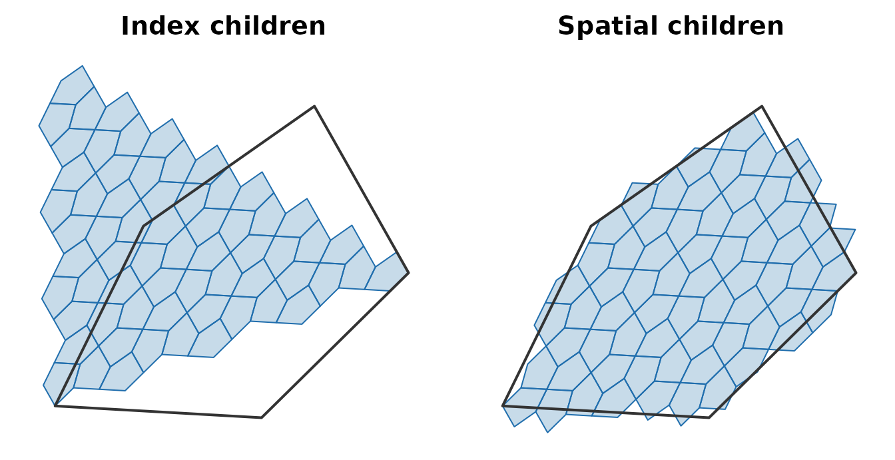
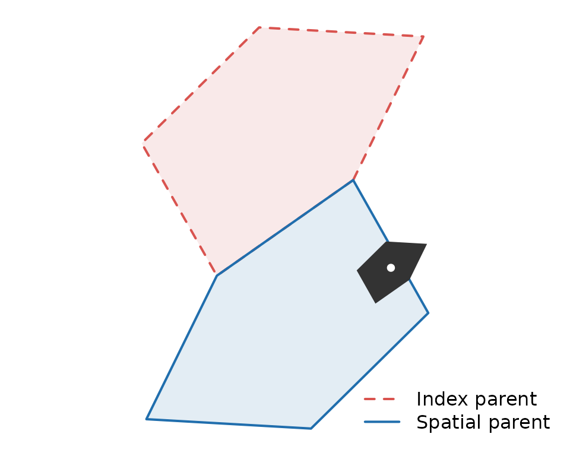
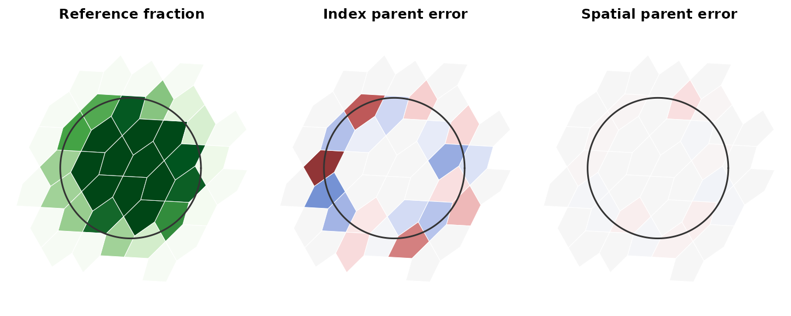

# Moving between resolutions by location

``` r

library(a5R)
```

[`a5_cell_to_spatial_parent()`](https://belian-earth.github.io/a5R/dev/reference/a5_spatial_hierarchy.md)
and
[`a5_cell_to_spatial_children()`](https://belian-earth.github.io/a5R/dev/reference/a5_spatial_hierarchy.md)
are experimental. Their names and behaviour may change.

## The index hierarchy is not spatially nested

[`a5_cell_to_parent()`](https://belian-earth.github.io/a5R/dev/reference/a5_hierarchy.md)
and
[`a5_cell_to_children()`](https://belian-earth.github.io/a5R/dev/reference/a5_hierarchy.md)
follow the A5 index. A cell’s index children do not tile it: some of
them lie mostly in its neighbours, and some cells inside it belong to a
neighbour’s index.

The spatial functions follow location instead. A fine cell belongs to
the coarse cell containing its centre.

``` r

cell <- a5_lonlat_to_cell(-53.5, -19, resolution = 8)
index_kids <- a5_cell_to_children(cell, resolution = 11)
spatial_kids <- a5_cell_to_spatial_children(cell, resolution = 11)

outline <- a5_cell_to_boundary(cell)
lim <- wk::wk_bbox(a5_cell_to_boundary(c(index_kids, spatial_kids)))
lim <- unclass(lim)

for (panel in list(list(index_kids, "Index children"),
                   list(spatial_kids, "Spatial children"))) {
  plot(NULL, xlim = c(lim$xmin, lim$xmax), ylim = c(lim$ymin, lim$ymax),
       asp = 1, axes = FALSE, xlab = "", ylab = "", main = panel[[2]])
  plot(a5_cell_to_boundary(panel[[1]]), col = "#206ead40",
       border = "#206ead", add = TRUE)
  plot(outline, border = "#333333", lwd = 2, add = TRUE)
}
```



Both sets hold 64 cells here, but only the spatial set sits inside the
outline. The mismatch is not rare:

``` r

set.seed(1)
fine <- a5_lonlat_to_cell(
  stats::runif(1e4, -54, -53), stats::runif(1e4, -19.5, -18.5),
  resolution = 18
)
mean(a5_cell_to_parent(fine, 15) != a5_cell_to_spatial_parent(fine, 15))
#> [1] 0.3677
```

For about a third of res-18 cells, the index parent at res 15 is a
neighbour of the cell they lie in.

The upward direction shows the same thing from the other side. Here is
one res-10 cell whose index parent at res 8 is not the cell it lies in:

``` r

kids <- a5_cell_to_children(a5_grid_disk(cell, 1), resolution = 10)
moved <- kids[a5_cell_to_parent(kids, 8) != a5_cell_to_spatial_parent(kids, 8)]
# the clearest case: the fine cell furthest from its index parent's centre
fine_cell <- moved[which.max(a5_cell_distance(moved, a5_cell_to_parent(moved, 8)))]
index_parent <- a5_cell_to_parent(fine_cell, 8)
spatial_parent <- a5_cell_to_spatial_parent(fine_cell, 8)

lim <- unclass(wk::wk_bbox(a5_cell_to_boundary(c(index_parent, spatial_parent))))

plot(NULL, xlim = c(lim$xmin, lim$xmax), ylim = c(lim$ymin, lim$ymax),
     asp = 1, axes = FALSE, xlab = "", ylab = "")
plot(a5_cell_to_boundary(index_parent), col = "#d9534f20", border = "#d9534f",
     lwd = 2, lty = 2, add = TRUE)
plot(a5_cell_to_boundary(spatial_parent), col = "#206ead20", border = "#206ead",
     lwd = 2, add = TRUE)
plot(a5_cell_to_boundary(fine_cell), col = "#333333", border = NA, add = TRUE)
plot(a5_cell_to_lonlat(fine_cell), pch = 19, cex = 0.8, col = "white", add = TRUE)
legend("bottomright", bty = "n", lwd = 2, lty = c(2, 1),
       col = c("#d9534f", "#206ead"), legend = c("Index parent", "Spatial parent"))
```



The fine cell (dark, with its centre in white) sits inside the spatial
parent, while its index parent is the neighbouring cell.

## Aggregating to a coarser grid

Take a complete res-18 layer over a small area containing a circular
patch, such as a stand of forest: cells inside the patch have value 1,
cells outside have value 0. Average it to res 15 under each rule.

``` r

area <- a5_lonlat_to_cell(-53.5, -19, resolution = 12)
layer <- a5_cell_to_children(a5_grid_disk(area, 1), resolution = 18)
length(layer)
#> [1] 24576

centre <- unclass(a5_cell_to_lonlat(area))
in_patch <- function(p) {
  p <- unclass(p)
  as.numeric((p$x - centre$x)^2 + (p$y - centre$y)^2 < 0.004^2)
}
fine <- data.frame(value = in_patch(a5_cell_to_lonlat(layer)))

mean_by <- function(cell, value) {
  stats::aggregate(list(value = value), list(cell = format(cell)), mean)
}
by_index <- mean_by(a5_cell_to_parent(layer, 15), fine$value)
by_spatial <- mean_by(a5_cell_to_spatial_parent(layer, 15), fine$value)
```

For a reference that uses neither hierarchy, drop two million random
points on the area, place each directly in its res-15 cell, and take the
share of points per cell that fall in the patch. This estimates each
coarse cell’s true patch fraction.

``` r

set.seed(1)
bb <- unclass(wk::wk_bbox(a5_cell_to_lonlat(layer)))
pts <- list(x = stats::runif(2e6, bb$xmin, bb$xmax),
            y = stats::runif(2e6, bb$ymin, bb$ymax))
truth <- mean_by(a5_lonlat_to_cell(pts$x, pts$y, resolution = 15), in_patch(pts))
names(truth)[2] <- "truth"

error <- function(agg) {
  m <- merge(agg, truth)
  m <- m[m$value > 0 | m$truth > 0, ]
  round(c(mean = mean(abs(m$value - m$truth)), max = max(abs(m$value - m$truth))), 3)
}
error(by_index)
#>  mean   max 
#> 0.086 0.338
error(by_spatial)
#>  mean   max 
#> 0.008 0.057
```

Aggregating by index parent misstates the patch fraction of the cells it
touches by about a tenth on average, and by a third at worst, because
each coarse cell averages fine cells from its neighbours. The spatial
rule is off only by the sampling noise of the reference.
[`format()`](https://rdrr.io/r/base/format.html) supplies a grouping key
here because base grouping functions cannot group an `a5_cell` vector
directly (see
[`vignette("internal-cell-representation")`](https://belian-earth.github.io/a5R/dev/articles/internal-cell-representation.md)).

Mapping the reference fractions, and each rule’s error against them,
shows where the index rule goes wrong:

``` r

grid <- merge(merge(truth, by_index, all.x = TRUE), by_spatial,
              by = "cell", all.x = TRUE, suffixes = c("_index", "_spatial"))
grid[is.na(grid)] <- 0
cells <- a5_cell(grid$cell)
xy <- unclass(a5_cell_to_lonlat(cells))
near <- (xy$x - centre$x)^2 + (xy$y - centre$y)^2 < 0.006^2
grid <- grid[near, ]
boundaries <- a5_cell_to_boundary(cells[near])
lim <- unclass(wk::wk_bbox(boundaries))

fraction_pal <- hcl.colors(101, "Greens", rev = TRUE)
error_pal <- hcl.colors(101, "Blue-Red 3")
ring <- seq(0, 2 * pi, length.out = 200)
error_col <- function(e) error_pal[round(pmin(pmax(e / 0.4, -1), 1) * 50) + 51]

for (panel in list(
  list(fraction_pal[round(grid$truth * 100) + 1], "Reference fraction"),
  list(error_col(grid$value_index - grid$truth), "Index parent error"),
  list(error_col(grid$value_spatial - grid$truth), "Spatial parent error")
)) {
  plot(NULL, xlim = c(lim$xmin, lim$xmax), ylim = c(lim$ymin, lim$ymax),
       asp = 1, axes = FALSE, xlab = "", ylab = "", main = panel[[2]])
  plot(boundaries, col = panel[[1]], border = "white", lwd = 0.5, add = TRUE)
  lines(centre$x + 0.004 * cos(ring), centre$y + 0.004 * sin(ring),
        col = "#333333", lwd = 1.5)
}
```



The left panel shades each res-15 cell by its patch fraction, from white
(none) to dark green (all), with the patch outline in dark grey. The
other two show aggregated minus reference, from blue (0.4 or more too
low) through grey to red (0.4 or more too high). Index aggregation is
wrong in both directions all along the patch edge, where a coarse cell’s
index children fall on the other side of the edge from the cell itself.
Spatial aggregation is grey apart from faint tints, which are sampling
noise in the reference.

## Expanding coarse cells

The downward direction is the exact inverse. Expanding a set of coarse
cells gives each fine cell once, inside the coarse cell whose centre
rule claims it:

``` r

patch <- a5_uncompact(a5_grid_disk(cell, 1), 8)
kids <- a5_cell_to_spatial_children(patch, resolution = 11, simplify = FALSE)
lengths(kids)
#> [1] 62 62 62 62 66 66

all_kids <- unlist(kids)
vctrs::vec_duplicate_any(all_kids)
#> [1] FALSE
all(a5_cell_to_spatial_parent(all_kids, 8) == rep(patch, lengths(kids)))
#> [1] TRUE
```

Counts vary slightly from cell to cell but average `4^3 = 64` for these
three resolution steps, as for index children.

## Which to use

Use the index functions for operations on ids: compaction, id ranges and
Hilbert ordering. Use the spatial functions whenever values move between
resolutions and must stay where they are on the ground.

The spatial functions cost more. The index functions are bit operations;
[`a5_cell_to_spatial_parent()`](https://belian-earth.github.io/a5R/dev/reference/a5_spatial_hierarchy.md)
locates each centre, taking about as long as
[`a5_lonlat_to_cell()`](https://belian-earth.github.io/a5R/dev/reference/a5_coordinates.md).
Both spatial functions run in parallel with
[`a5_set_threads()`](https://belian-earth.github.io/a5R/dev/reference/a5_threads.md).
